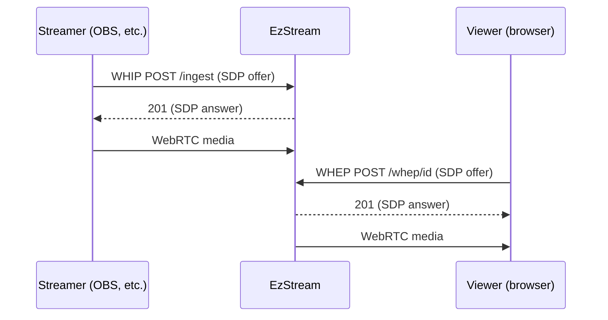

# EzStream

A lightweight live streaming server that uses WebRTC for both ingest and playback. Streamers publish via [WHIP](https://www.ietf.org/archive/id/draft-ietf-wish-whip-01.html) and viewers watch via [WHEP](https://www.ietf.org/archive/id/draft-murillo-whep-00.html), enabling sub-second latency end-to-end.

## Architecture



- **ChannelStore** manages channel configuration (ID, name, auth key) loaded from a JSON file.
- **Notifier** handles real-time push notifications to connected browsers over WebSocket when streams go live or offline.
- **Server** holds all WebRTC state, authenticates ingest requests, and fans out media from one streamer to many viewers using Pion's `TrackLocalStaticRTP`.

Pion's default interceptors (NACK, RTCP reports, TWCC) are enabled along with IntervalPLI for periodic keyframe requests, so new viewers get a clean picture quickly.

## Configuration

Channels are defined in a JSON file:

```json
[
    {
        "id": "hello",
        "name": "My First Stream!",
        "authKey": "secretkeygoeshere"
    }
]
```

## Running with Docker

```sh
docker run -d \
    -p 8080:8080 \
    -p 20000-21000:20000-21000/udp \
    -v /path/to/channels.json:/app/channels.json \
    ghcr.io/haydenmc/ezstream \
    -channelsJsonFile /app/channels.json
```

| Flag | Default | Description |
|------|---------|-------------|
| `-channelsJsonFile` | `channels.json` | Path to channels JSON config |
| `-httpListenAddress` | `:8080` | HTTP listen address |
| `-minUdp` | `20000` | Minimum UDP port for WebRTC |
| `-maxUdp` | `21000` | Maximum UDP port for WebRTC |
| `-networkInterface` | (all) | Restrict to a specific network interface |

The UDP port range must be published for WebRTC media transport.

## Streaming

**Ingest (WHIP):** Configure your streaming software to publish to `http://<host>:8080/ingest` with the channel's auth key as a Bearer token.

**Watch:** Open `http://<host>:8080` in a browser and click a channel, or navigate directly to `http://<host>:8080/watch/<channelId>`.

## Building from source

```sh
cd src
go build -o ezstream .
./ezstream
```
